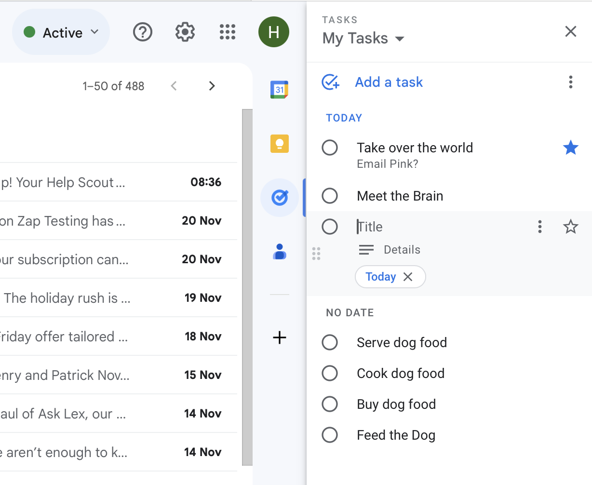
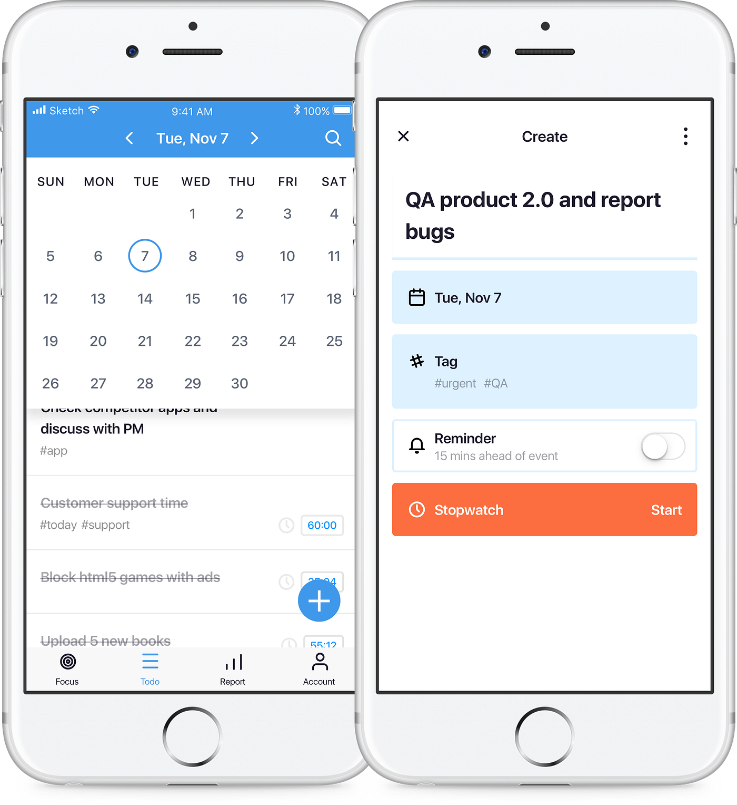
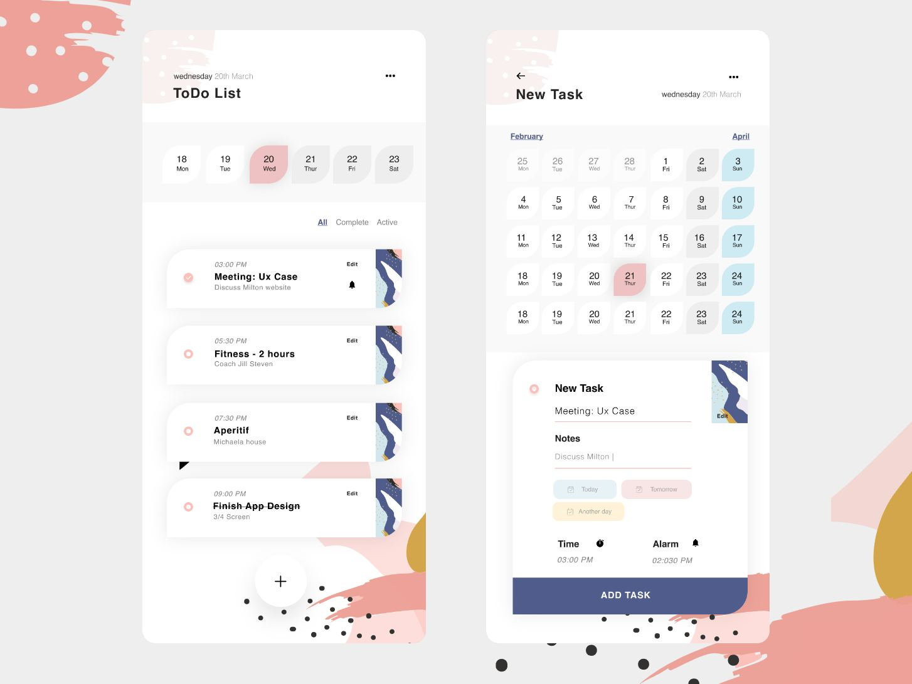
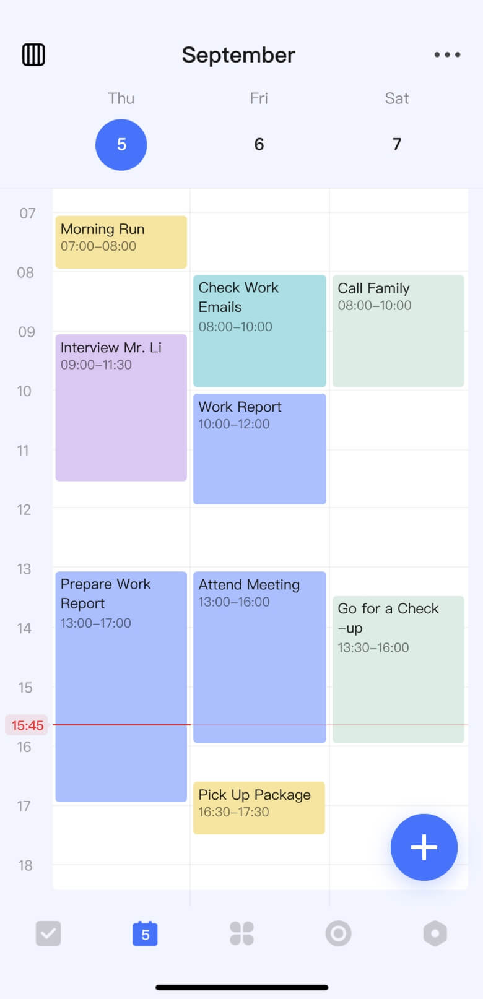

### Reference for Design









## 📄 `README.md` Sample

# Yii2 Todo App

## Requirements

- PHP 7.4+
- MySQL or MariaDB
- Composer

## Setup Instructions

1. Clone the project:

```

git clone [https://github.com/your-username/yii2-todo.git](https://github.com/your-username/yii2-todo.git)
cd yii2-todo

```

2. Install dependencies:

```

composer install

```

3. Configure DB in `config/db.php`.

4. Run migration:

```

php yii migrate

```

5. Start dev server:

```

php yii serve

```

6. Access app at:

[http://localhost:8080](http://localhost:8080)

## Features

- Add, view, update, delete tasks
- Mark tasks complete/incomplete
- Due date tracking
- Simple UI with Bootstrap
